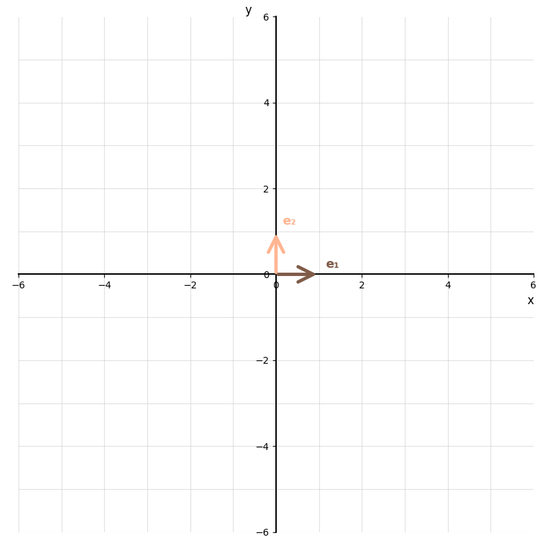

# panchi

**panchi** is a Python-native linear algebra library designed for learning, experimentation, and visual intuition.

The goal is not performance. The goal is **clarity**.

<figure class="viz" markdown="span">
  
  <figcaption>A shear, drawn by panchi — the whole plane morphing under <code>Matrix([[1, 1], [0, 1]])</code>. Every visual on this site is generated with panchi's own <code>Animator2D</code>.</figcaption>
</figure>

If you have ever used NumPy or SciPy and wondered *what the library is actually doing*, panchi is for you. Every algorithm is implemented directly in readable Python, every operation returns something you can inspect, and error messages are written to teach rather than just report.

panchi's central philosophy can be summed up in the following points:

* **Built for education:** the project's central aim is to allow for people to learn the beauty of linear algebra.
* **Made for tinkering:** all design decisions - from the name to the code - are made to encourage building and taking things apart.
* **Clarity is queen:** code should be as clear as possible, avoiding terse, overly pythonic notation and obscure algorithms so the central idea is clear-as-day.

---

## Where to start

If you are new to panchi, begin with the [Getting started](quickstart.md) — it covers the core ideas in a few minutes.

If you are looking for a specific function or class, go straight to the [API Reference](api/panchi.md).

If you want to understand the concepts behind the code, the [User Guide](user-guide/vectors.md) walks through each part of the library with worked examples and mathematical context.

---

## What panchi covers

- `Vector` and `Matrix` numeric primitives with natural operator syntax
- Factory functions: identity, zero and ones matrices, diagonal, rotation matrices, and more
- Elementary row operations as first-class objects
- Row reduction to REF and RREF
- LU and QR decomposition (QR via Gram-Schmidt)
- Eigenvalues and eigenvectors via the QR algorithm
- Matrix inverse and linear system solving (with an optional numerical tolerance)
- Rich result formats for algorithms, allowing for step-by-step inspection
- [2D visualization](user-guide/visualizations.md) of vectors, linear transformations, and spans via Matplotlib, with optional Manim backend

---

## Links

* [**Source code**](https://github.com/Gustavo-Galvao-e-Silva/panchi)
* [**PyPI page**](https://pypi.org/project/panchi/)
